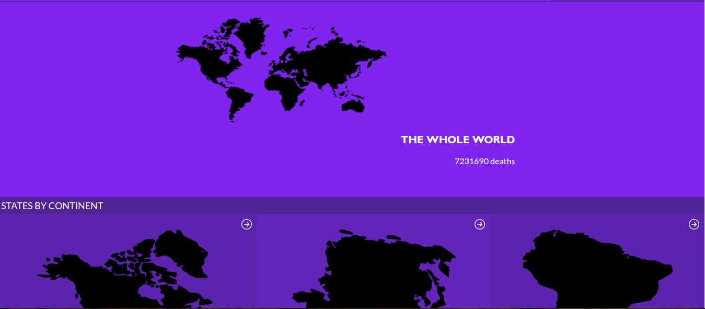
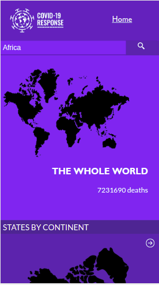
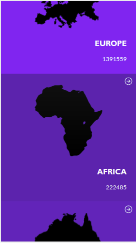

# React Capstone: Metrics webapp

This React capstone project is about building a mobile web application to check a list of metrics (numeric values) that we created making use of React and Redux.

We selected an API that provides numeric data about a topic that we like and then build the web app around it. The web app has several pages:

- one page with a list of items that could be filtered by some parameters. An example can be a list of metrics that can be filtered by the country (imagine a search field to introduce the country name like Italy, Croatia, etc.). This page should be our homepage.
  
- one page for the item details; in the example, the detail page for Czech Republic cities with a number of views.





## Built With

- React
- React-redux
- React-router-dom
- <a href="https://documenter.getpostman.com/view/10831675/SzYZ1eNY">Covit-19 Data API</a>

## Live Demo

[Live Demo Link](https://619e92c7f14e93a7ecac8a2d--romantic-euclid-b0bb8f.netlify.app/)
Additional description about the project and its features.
## Available Scripts

## Getting Started

**This is an example of how you may give instructions on setting up this project locally. To get a local copy up and running follow these simple steps.**


### Prerequisites
This is an example of how to list things you need to use the software and how to install them.
* npm
  ```sh
  npm install npm@latest -g

### Setup

### Install

Please follow these steps to install the project locally

1. Clone the repo
   ```sh
   git clone https://github.com/azy64/react-capstone.git
   ```
2. Install NPM or YARN packages
   ```sh
   npm install
   ```

   ```sh
   yarn
   ```
3. Run the App
   
   ```sh
   npm start
   ```   
    or

   ```sh
   yarn start
   ```   
<!--### Usage -->

### Run tests
Run test with the following command:

 ```sh
 yarn test

 ```   
   or
```sh
   npm test

```   

## Author

👤 **AZARIA**

- GitHub: [@azy64](https://github.com/azy64)
- LinkedIn: [LinkedIn](https://www.linkedin.com/in/azaria-saidi-524780112/)


## 🤝 Contributing

Contributions, issues, and feature requests are welcome!

Feel free to check the [issues page](../../issues/).

## Show your support

Give a ⭐️ if you like this project!

## Acknowledgments

- <a href="https://www.behance.net/gallery/31579789/Ballhead-App-(Free-PSDs)">Nelson Sakwa</a>

## 📝 License

This project is [MIT](./MIT.md) licensed.